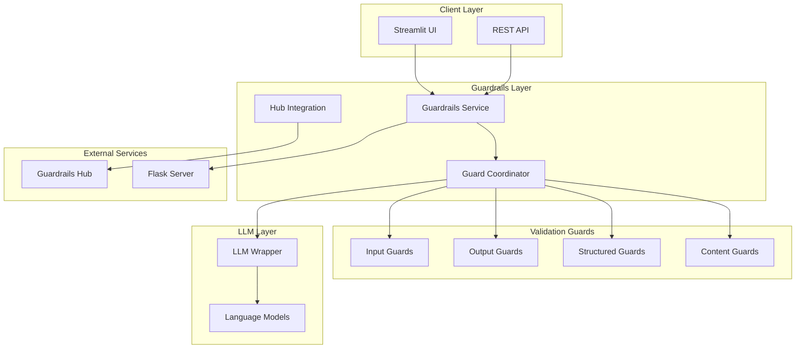
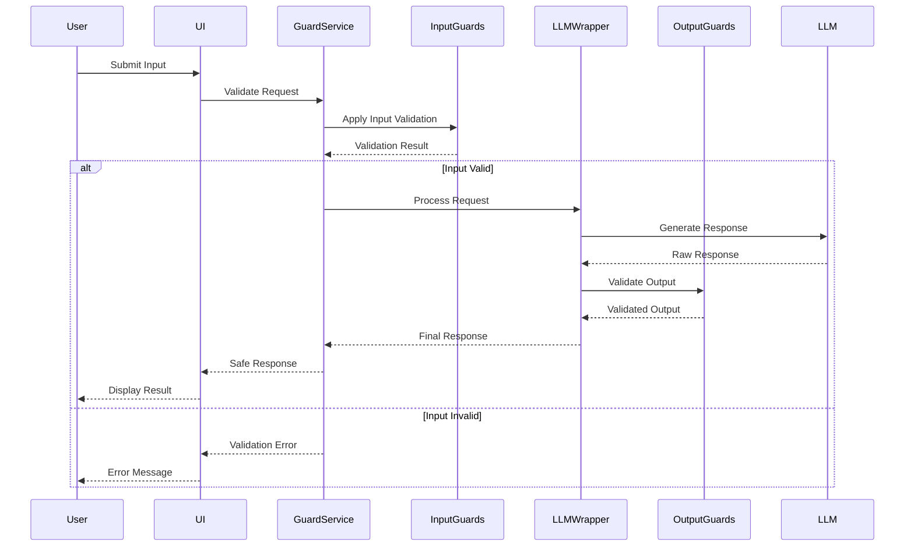

# Design Document

## Overview

The Enhanced Guardrails System extends the existing guardrails functionality by integrating Guardrails Hub validators, implementing comprehensive input/output guards, and adding support for structured data generation. The design maintains backward compatibility while adding robust validation capabilities that can operate both embedded and as a standalone service.

## Architecture

### High-Level Architecture



### Component Interaction Flow



## Components and Interfaces

### 1. Enhanced Guardrails Configuration

**Purpose:** Manages Guardrails Hub integration and guard configurations

**Key Interfaces:**
```python
class EnhancedGuardrailsConfig:
    def install_hub_validator(self, validator_name: str) -> bool
    def create_guard_from_hub(self, validators: List[str], config: Dict) -> Guard
    def get_structured_guard(self, model_class: BaseModel) -> Guard
    def configure_server_mode(self, host: str, port: int) -> bool
```

**Responsibilities:**
- Manage Guardrails Hub CLI integration
- Cache installed validators
- Configure guard combinations
- Handle server mode setup

### 2. Guard Factory

**Purpose:** Creates and manages different types of guards based on use cases

**Key Interfaces:**
```python
class GuardFactory:
    def create_input_guard(self, validators: List[str]) -> Guard
    def create_output_guard(self, quality_rules: Dict) -> Guard
    def create_structured_guard(self, schema: BaseModel) -> Guard
    def create_composite_guard(self, guard_configs: List[Dict]) -> Guard
```

**Responsibilities:**
- Instantiate guards with proper configurations
- Manage guard lifecycle
- Handle guard composition and chaining

### 3. Validation Orchestrator

**Purpose:** Coordinates validation across multiple guards and handles failures

**Key Interfaces:**
```python
class ValidationOrchestrator:
    def validate_input(self, content: str, context: Dict) -> ValidationResult
    def validate_output(self, content: str, schema: Optional[BaseModel]) -> ValidationResult
    def apply_corrections(self, content: str, failures: List[ValidationFailure]) -> str
    def get_validation_metrics(self) -> Dict[str, Any]
```

**Responsibilities:**
- Execute validation pipelines
- Handle validation failures and retries
- Apply automatic corrections
- Collect validation metrics

### 4. Hub Integration Manager

**Purpose:** Manages integration with Guardrails Hub for validator installation and updates

**Key Interfaces:**
```python
class HubIntegrationManager:
    def configure_hub_cli(self) -> bool
    def install_validator(self, hub_path: str) -> bool
    def list_available_validators(self) -> List[str]
    def update_validators(self) -> Dict[str, bool]
```

**Responsibilities:**
- Configure Guardrails Hub CLI
- Install and update validators
- Manage validator dependencies
- Handle offline fallbacks

### 5. Structured Data Generator

**Purpose:** Generates structured data from LLMs using Pydantic models and Guardrails

**Key Interfaces:**
```python
class StructuredDataGenerator:
    def generate_with_schema(self, prompt: str, schema: BaseModel, llm: BaseLanguageModel) -> Any
    def validate_structured_output(self, data: Any, schema: BaseModel) -> ValidationResult
    def handle_function_calling(self, llm: BaseLanguageModel, schema: BaseModel) -> bool
    def optimize_prompt_for_schema(self, prompt: str, schema: BaseModel) -> str
```

**Responsibilities:**
- Generate structured data using function calling or prompt optimization
- Validate structured outputs against Pydantic schemas
- Handle LLM compatibility differences
- Retry failed structured generation

### 6. Guardrails Server Interface

**Purpose:** Provides REST API interface for standalone Guardrails service

**Key Interfaces:**
```python
class GuardrailsServerInterface:
    def start_server(self, config_path: str, host: str, port: int) -> bool
    def validate_via_api(self, content: str, guard_name: str) -> ValidationResult
    def proxy_openai_request(self, request: Dict) -> Dict
    def health_check(self) -> bool
```

**Responsibilities:**
- Start and manage Flask server
- Provide REST API endpoints
- Handle OpenAI SDK proxy functionality
- Monitor server health

## Data Models

### Validation Result Model
```python
class ValidationResult(BaseModel):
    is_valid: bool
    processed_content: str
    original_content: str
    failures: List[ValidationFailure]
    corrections_applied: List[str]
    validation_time: float
    guard_name: str
```

### Guard Configuration Model
```python
class GuardConfig(BaseModel):
    name: str
    validators: List[ValidatorConfig]
    failure_action: OnFailAction
    retry_count: int = 3
    timeout: float = 30.0
    enabled: bool = True
```

### Validator Configuration Model
```python
class ValidatorConfig(BaseModel):
    type: str  # "hub", "builtin", "custom"
    name: str
    parameters: Dict[str, Any]
    on_fail: OnFailAction
    priority: int = 0
```

### Structured Schema Registry
```python
class SchemaRegistry:
    def register_schema(self, name: str, schema: BaseModel) -> None
    def get_schema(self, name: str) -> Optional[BaseModel]
    def list_schemas(self) -> List[str]
```

## Error Handling

### Validation Failure Handling
1. **Input Validation Failures:**
   - Log failure details with context
   - Provide user-friendly error messages
   - Offer suggestions for correction
   - Block processing until valid input

2. **Output Validation Failures:**
   - Apply automatic corrections when possible
   - Regenerate response with modified prompts
   - Fallback to safe default responses
   - Log incidents for analysis

3. **Hub Integration Failures:**
   - Cache validators locally for offline use
   - Fallback to built-in validators
   - Retry with exponential backoff
   - Graceful degradation of functionality

4. **Server Mode Failures:**
   - Automatic fallback to embedded mode
   - Health check monitoring
   - Circuit breaker pattern for resilience
   - Connection pooling and retry logic

### Error Recovery Strategies
```python
class ErrorRecoveryStrategy:
    def handle_validation_timeout(self, context: Dict) -> ValidationResult
    def handle_hub_unavailable(self, validator_name: str) -> Guard
    def handle_server_unreachable(self) -> None
    def handle_schema_validation_error(self, data: Any, schema: BaseModel) -> Any
```

## Testing Strategy

### Unit Testing
- **Guard Factory Tests:** Verify correct guard instantiation and configuration
- **Validation Logic Tests:** Test individual validator behavior and edge cases
- **Hub Integration Tests:** Mock Hub API responses and test error handling
- **Structured Generation Tests:** Validate schema compliance and data integrity

### Integration Testing
- **End-to-End Validation Flow:** Test complete input → processing → output pipeline
- **Server Mode Integration:** Test REST API functionality and OpenAI proxy
- **LLM Wrapper Integration:** Verify seamless integration with existing LLM calls
- **Fallback Mechanism Tests:** Test graceful degradation scenarios

### Performance Testing
- **Validation Latency:** Measure impact on response times
- **Concurrent Validation:** Test multiple simultaneous validation requests
- **Memory Usage:** Monitor memory consumption with large guard configurations
- **Server Scalability:** Test Guardrails server under load

### Security Testing
- **Input Sanitization:** Test malicious input handling
- **Output Filtering:** Verify sensitive content detection and removal
- **Configuration Security:** Test secure storage of guard configurations
- **API Security:** Validate REST API authentication and authorization

## Implementation Phases

### Phase 1: Hub Integration Foundation
- Configure Guardrails Hub CLI integration
- Implement validator installation and caching
- Create basic guard factory with hub validators
- Add configuration management for hub validators

### Phase 2: Enhanced Input/Output Guards
- Extend existing input validation with hub validators
- Implement comprehensive output quality guards
- Add structured data generation capabilities
- Integrate with existing LLM wrapper

### Phase 3: Server Mode Implementation
- Implement Guardrails Flask server
- Add REST API endpoints for validation
- Create OpenAI SDK proxy functionality
- Implement health monitoring and fallback

### Phase 4: Advanced Features and Optimization
- Add validation metrics and monitoring
- Implement advanced error recovery
- Optimize performance for production use
- Add comprehensive logging and debugging